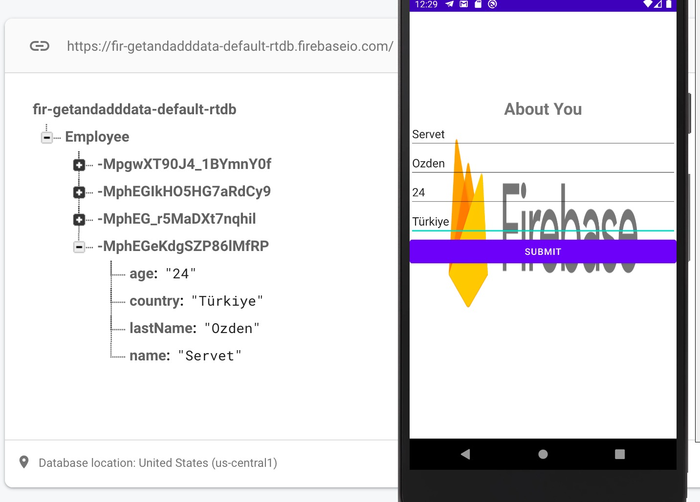

# Firebase Realtime Database<dt>

 Store and sync data with our NoSQL cloud database. Data is synced across all clients in realtime, and remains available when your app goes offline.

  https://firebase.google.com/docs/database/android/start got help from website<dt>

    
 # Image <dt>   
I did add and list data using Firebase Realtime Database<dt>

